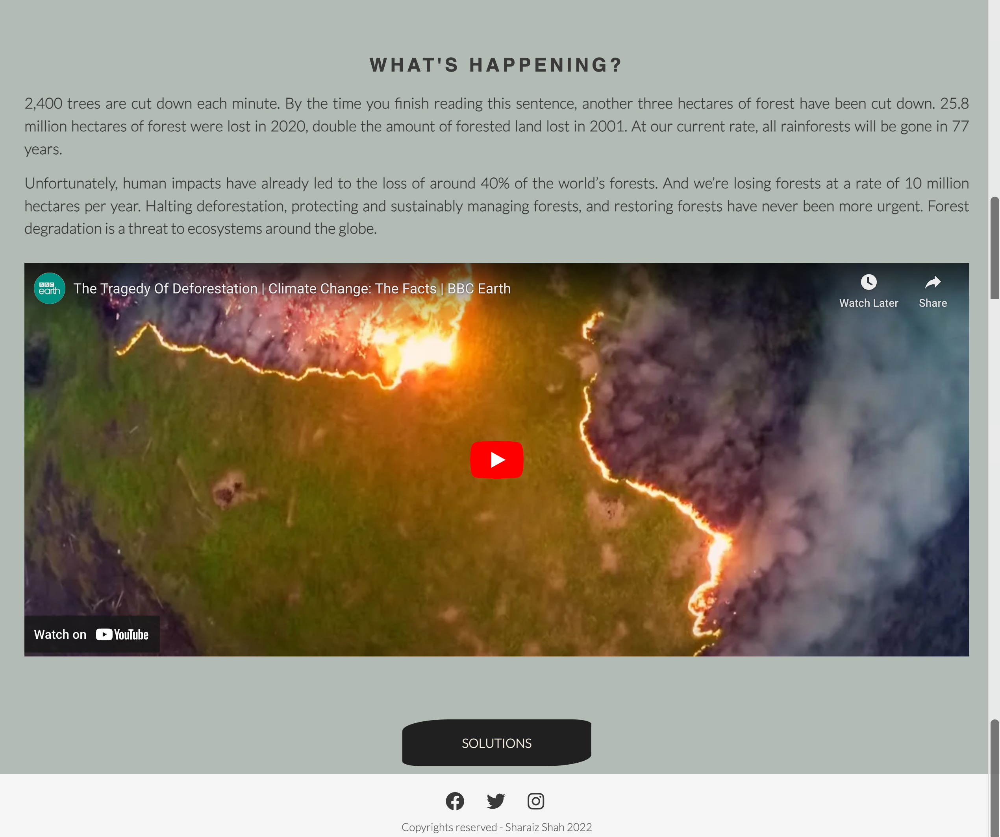

# Deforestation 
This project is a simple yet impactful website aimed at raising awareness about deforestation and its harmful effects on the environment. The website provides information about the issue of deforestation and offers solutions to mitigate its impact.

* View [Deforestation](https://srz97.github.io/deforestation/) page here.

## CONTENTS

* [User Experience](#user-experience-ux)
  * [User Stories](#user-stories)

* [Design](#design)
  * [Colour Scheme](#colour-scheme)
  * [Typography](#typography)
  

* [Features](#features)
  * [General Features on Each Page](#general-features-on-each-page)
  * [Accessibility](#accessibility)

* [Technologies Used](#technologies-used)
* [Languages Used](#languages-used)

## [Deployment](#deployment)

 * [Testing](#testing)

 * [Credits](#credits)
  
  * [Media](#media)
 

## User Experience (UX)
The Deforestation Awareness Website is designed to educate visitors about the consequences of deforestation and encourage them to take action to preserve our forests. The website features a clean and responsive design, making it accessible across various devices.

## Initial Discussion

Deforestation is an online web page that informs and creates awarness amoung the user about the current rate of Deforestaion and steps which could be taken in order to protect our planet from ruthless cutting of trees.

## Key information for the site

* Why should we Care about this issue.
* What are the Causes of Deforestation.
* What is the current Rate of Deforestation.
* What are the steps should be taken.
* A way for people to know and be aware of the situation regarding Deforestation.

# User Stories

## Client Goals. 

* To be able to view the site on a range of device sizes.
* To make it easy for potential members to find out what happening with our planet and how to take part.
* To make it clear for members to see what is current Situation and what are the Solutions.
* To allow people to be able to take steps and recommendations etc.

##  First Time Visitor Goals

* I want to find out what is Deforestation website is aiming for and how I can take part.
* I want to be able to navigate the site easily to find information.
* I want to be able to find their Instagram profile.

## Returning Visitor Goals

* I want to find up to the solutions.
* Frequent Visitor Goals
* I want to be able to recommend the webpage for to read.

## Frequent Visitor Goals

* Stay Informed: Regularly visiting the website allows you to stay informed about the latest affairs of deforestation.

* Access Solutions: The "Solution" section of the website offers practical strategies and approaches to stop deforestation. Frequent visitors can explore these solutions in depth, gaining insights into how they can personally contribute to the cause.

* Engage and Share: The website provides easy access to social media integration, enabling you to share informative content with your network and engage in discussions about deforestation. By sharing content from the website, you can contribute to spreading awareness and rallying support.

# Design

# Colour Scheme

# Typography

* Google Fonts was used for the following fonts:
* lato, Helvetica is used for headings and body on the site. It is a serif font.
* Font awsome is used for the icons.
* The mobile navigation bar's functionality is enhanced through the use of JavaScript to ensure smooth navigation on smaller screens.

# Imagery 

* The member images were used with the permission of their owners. All covers were taken from the websites. I have credited [pexels](https://www.pexels.com/)

# Key Features:
Navigation Bar: The responsive navigation bar enables seamless navigation across the website. Users can effortlessly explore various sections to access comprehensive information.

Section Layouts: The Home Page boasts a clean and intuitive layout designed to engage visitors. It adapts gracefully to different screen sizes, ensuring a consistent user experience across devices.

Navigation Button: At the bottom of the page, a strategically placed button encourages users to take the next step by leading them to the "Current Situation" page. This design choice facilitates a smooth flow of information.

Footer: The footer is equipped with social media icons linked to Instagram, Facebook, and Twitter. These universally recognizable icons provide visitors with the opportunity to engage further and stay updated on relevant content.

* * The heading on the top right corner along with a nav bar on the right side. consist of four different Sections
* * The title along with a catchy sub-heading and a picture in the background.
 
 
 * *The Reasons Section serves as a compelling introduction, outlining the critical importance of understanding and addressing deforestation. It engages users by addressing the question, "Why should they be concerned?" This section offers a concise yet impactful overview of the significance of the issue, motivating visitors to delve further into the website's content.
           
  

* * The Current Situation Section.Briefly describes about whats going on right now And then their is a video attched along
which ease the user experience regarding the topic.

* Solutions Page 

* * Title and the background images gives the user a reason of their current presence at the site.
* * Then it consists of Four different motivational Images along with a persuading captions and icons attched to create more interest and motivate the user. 
 
 
  
   
 
* Form Page 
* * The Sing Up form which allows the user to put in their Information.
 
 

## Accessibility

I have been mindful during coding to ensure that the website is as accessible friendly as possible. I have achieved this by:

Using semantic HTML.
Using descriptive alt attributes on images on the site.
Providing information for screen readers where there are icons used and no text.
Ensuring that there is a sufficient colour contrast throughout the site.
Ensuring menus are accessible by marking the current page as current for screen readers.

# Languages Used
* HTML and CSS were used to create this website.

# Technologies Used
 

* Frameworks, Libraries & Programs Used

* Git - For version control.

* Github - To save and store the files for the website.

 * Bootstrap Version 4.6 - The framework for the website. Code for the navigation bar, carousel, cards and form were used and modified. Additional CSS styling was also implemented in style.css.

* Google Fonts - To import the fonts used on the website.

* Font Awesome - For the iconography on the website.

* Google Dev Tools - To troubleshoot and test features, solve issues with responsiveness and styling.

* [Am I Responsive?](https://ui.dev/amiresponsive?url=https://srz97.github.io/deforestation/)To show the website image on a range of devices.

# Testing
 
* I tested that this project works responsive, looks good and funcional on all standard screen sizes using the divtools devie tool bar.
* I have confirmed that the navigation works on the large screen and the buttons on the smaller screens
* I checked the form works acurately. 

# W3C Validator
* The W3C validator was used to validate the HTML on all pages of the website. It was also used to validate CSS in the style.css file.

# Unfixed Bugs 
* No unfixed bugs

# Deployment 
* Github Pages was used to deploy the live website. The instructions to achieve this are below:

* * Log in (or sign up) to Github.
* * Find the repository for this project, Deforestation.
* * Click on the Settings link.
* * Click on the Pages link in the left hand side navigation bar.
* * In the Source section, choose main from the drop down select branch menu. Select Root from the drop down select folder menu.
* * Click Save. Your live Github Pages site is now deployed at the URL shown.

# Credits

* The code to create Form and social Media Link was taken from [Love Running](https://learn.codeinstitute.net/courses/course-v1:CodeInstitute+LR101+2021_T1/courseware/4a07c57382724cfda5834497317f24d5/f2db5fd401004fccb43b01a6066a5333/) project.
* [Google](https://www.google.com/) Search Engine was used for the Facts.
* [WWF](https://www.worldwildlife.org/threats/deforestation-and-forest-degradation) was used for the information.

# Media 

* All images used in the project Deforestation are from [Pexels](https://www.pexels.com/)

